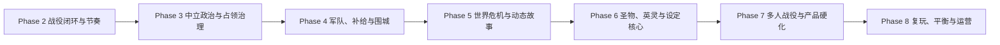

# 英灵城邦战略战役产品审计与阶段规划

> 状态：战略产品主线的诊断与阶段设计依据
> 生效日期：2026-07-17
> 目标：在不改变既有世界观和已确认规则的前提下，把当前战略沙盒推进为目标明确、因果可读、能够结束并愿意重开的大战役产品。

## 1. 结论

当前大地图已经具备大量可运行模块，但仍是“可操作的战略沙盒”，不是“可完成的战略战役”。

玩家现在可以建立战役、选择武将身份、通过官职执行行动、经营城市、祭祀召唤、处理事件、教唆中立城邦、进攻相邻城市并把格子战结果写回战略存档。问题不在于没有按钮，而在于这些按钮没有共同服务一条可理解的战役主线：

- 没有明确的战役时限、阶段升级、高潮和完整结算。
- 中立城邦数量最多，却主要是被教唆或被征服的目标。
- 战争从城市直接跳进战斗，没有军队、行军、补给、拦截、撤退和围城过程。
- 资源、科技、官职和支持度有数值，但玩家难以预判“本月选择会如何改变未来两三个月”。
- 英灵、事件和世界记忆已经存在，却尚未形成角色关系与世界主线。
- AI 会执行动作，但不会展示并持续追求一个可被玩家判断的多月目标。

因此，后续开发不再按“补齐一个大系统”的方式推进，而按“每个 Phase 都闭合一段玩家旅程”的方式推进。

## 2. 不改变的产品设定

以下内容是重排玩法时必须保留的边界：

1. 玩家和战略 AI 都由一名唯一战略武将代表，不以抽象势力替代角色。
2. 主公、大将军、将军、城主是固定正式职位；玩家和 AI 都通过职位权限行动。
3. 新武将通过己方城市祭祀场随机召唤并绑定召唤城市，不恢复已取消的求贤链。
4. 主要势力各从一城起步，地图上中立城邦严格多于主要势力起始城市。
5. 中立城邦由具名凡人城主管理，除非受到教唆或自身遭受威胁，否则不主动扩张。
6. 关键冲突进入现有格子战；手动、AI 自动、观看 AI 和快速结算继续并存。
7. 无城势力进入流亡路线，不因失城立刻 Game Over。
8. 统一、敌对势力消灭/吸收、世界主线、圣物祭坛是可并存的胜利方向。

## 3. 当前实际玩家循环

当前循环大致是：

1. 创建或加入战役，锁定真人席位，其余主要势力交给 AI。
2. 选择唯一战略武将及主公、在野、建国或投靠路径。
3. 在四种职位工作台查看城市、资源、事件、军令和边境。
4. 每势力每月用 4 点军令安排方针、建筑、科技、祭祀、任命、叛乱处理、教唆或进攻。
5. 房主推进月份，按队列结算玩家行动，再结算 AI、城市收入、维护、支持度、叛乱和事件。
6. 相邻城市进攻直接生成快速结算或真实格子战，随后写回兵力、城市归属、支持度与英灵状态。
7. 通过统一全部城市或只剩一个有城主要势力触发当前胜利记录；失城势力继续流亡。

这条循环在工程上可以运转，但在产品上缺少“战役目标—准备—冲突—后果—升级—终局”的完整节奏。

## 4. 闭环缺口审计

| 系统 | 当前状态 | 无法成环的原因 | 产品后果 | 归属 Phase |
| --- | --- | --- | --- | --- |
| 战役目标 | 统一与消灭可判定，世界主线和圣物目标仅占位 | 没有期限、阶段、评分、结局与继续选择 | 玩家只能无限经营或重复吞城 | Phase 2 |
| 月度节奏 | 有 4 军令、行动队列和局势简报 | 缺少上月变化、未来预测和阶段目标 | 决策像填写表单，不像制定计划 | Phase 2 |
| 新手旅程 | 能创建、锁定、选择身份并进入战情室 | 没有前三个月的引导目标和完成反馈 | 玩家看到系统，但不知道先做什么 | Phase 2 |
| 中立城邦 | 一城一邦、具名城主、被动守备、可教唆 | 没有关系、需求、交易、保护、臣属或和平整合 | 地图多数内容退化为征服填充物 | Phase 3 |
| 外交 | 势力模型有外交字段，实际行动只有教唆 | 没有承诺成本、期限、信誉和外交记忆 | 玩家与 AI 之间几乎只有战争 | Phase 3 |
| 占领治理 | 战斗后可立即改归属并调整支持度 | 没有自治、驻军、整合、掠夺或复国选择 | 攻城后果太薄，滚雪球过快 | Phase 3 |
| 战略战争 | 相邻城市直接宣战并进入结算 | 没有持久军队、行军时间、补给、拦截、援军、撤退和围城 | 地图路线与后勤不构成战略 | Phase 4 |
| 官职军令 | 权限、命令链、请兵与特色单位库存已存在 | 军队不是地图实体，组织复杂度没有对应收益 | 官职更像操作限制，而非协作能力 | Phase 4 |
| 经济 | 城市收入、粮食维护、政策、建筑和科技已存在 | 缺少预算预测、运输损耗和多月投资回报 | 资源多但战略取舍不够清晰 | Phase 2、4 |
| 叛乱与民心 | 风险、叛军、安抚、赈济和镇压已有基础 | 缺少谈判、自治、倒戈、占领整合和外部支持 | 叛乱主要是周期性扣数 | Phase 3 |
| 世界故事 | 有本地事件、延迟后果和世界记忆 | 没有改变地图压力的多阶段主线 | 战役没有中盘转折和终局高潮 | Phase 5 |
| 英灵 | 有祭祀、职位、参战、沉睡与恢复 | 缺少忠诚、个人任务、关系和战略专长后果 | 英灵主要是容量和战斗加成 | Phase 6 |
| 圣物祭坛 | 规则与胜利槽位存在，实体未实现 | 尚未与祭祀、城市争夺和英灵风险形成循环 | 设定辨识度没有进入玩法核心 | Phase 6 |
| AI | 能经营、祭祀、防守、进攻并遵守军令 | 没有公开目标、外交判断、多月计划和危机响应 | AI 像自动脚本，不像战略对手 | Phase 2～5 |
| 多人推进 | 有成员、职位、在线状态和恢复门槛 | 所有初始真人必须在线，缺少月度提交、期限与代理 | 长战役容易因一人缺席停摆 | Phase 7 |
| 存档与运营 | 战役 JSON 持久化并可恢复 | 缺少版本迁移、恢复工具、最终战绩和战役历史 | 无法安全支撑长期真实战役 | Phase 7 |
| 复玩 | 随机地图、资源和武将池已有变化 | 缺少场景压力、城邦诉求、胜利路线和危机变体 | 随机性改变布局，不改变策略问题 | Phase 8 |

## 5. 目标玩家循环

后续所有系统必须服务以下循环：

1. **读局势**：看到上月变化、当前威胁、机会、敌方意图和战役时限。
2. **定目标**：选择本月或未来两三个月的政治、建设、战争或主线目标。
3. **分资源**：用有限军令、钱粮、以太、英灵和官职容量安排计划。
4. **执行计划**：谈判、治理、编军、行军、处理事件或进入格子战。
5. **承受后果**：城市关系、民心、补给、军队、英灵和世界状态发生可解释变化。
6. **进入升级**：世界压力和对手计划改变，迫使玩家调整下一月目标。
7. **完成战役**：在固定期限或主线高潮后获得明确结局、评分与继续沙盒选择。

每月玩家应优先面对 1～3 个有后果的决定。重复维护由职位 AI 或默认方针执行；官职系统负责提出方案、授权和执行，而不是要求玩家重复操作所有城市。

## 6. 玩法修正原则

1. **先做有终点的短战役，再扩展无限沙盒。** 首个产品目标是 8 城、2 个主要势力、6 个中立城邦、12 个月的 60～90 分钟战役。
2. **中立城邦必须有两种以上有效解法。** 至少能通过援助/保护/影响和平整合，也能被教唆、威慑或征服。
3. **战争必须占用时间和空间。** 军队移动、补给、拦截、撤退和围城让路线与准备产生价值。
4. **占领不是战斗结束。** 新城必须在自治、整合、驻军和掠夺之间选择，并承担支持度与叛乱后果。
5. **用世界危机制造共同的战役时钟。** 第一条主线优先实现雪鬼；电子世界危机后置为复玩变体。
6. **AI 差异来自处境和目标，不来自固定性格标签。** 这符合既有规则，也能让玩家读懂它的行动。
7. **格子战是高价值冲突解决层。** 每场战役预期触发 1～3 场关键格子战，普通小冲突允许快速结算。
8. **随机不是复玩的替代品。** 复玩来自不同城邦诉求、世界压力、胜利路线和地图资源组合。

## 7. 阶段依赖

详细范围、退出门槛和状态以《产品开发路线图》为准。

## 8. 当前优先级决定

- 立即进入新的 Phase 2“战役闭环与节奏”，不等待独立格子对战留存指标。
- 已完成的账号武将熟练度 P2.1 保留，作为未来战役成就与角色成长展示的基础设施。
- 每日/每周任务、好友分享、独立对战平衡看板和继续扩大的账号留存系统暂停；只有直接服务大战役闭环时才恢复。
- 正式军队、完整外交、世界危机、圣物祭坛不并行铺开，按依赖顺序进入各自 Phase。
- 每个 Phase 工程完成后先提交阶段复盘，向项目负责人报告退出门槛状态，获得明确确认后再进入下一 Phase。
